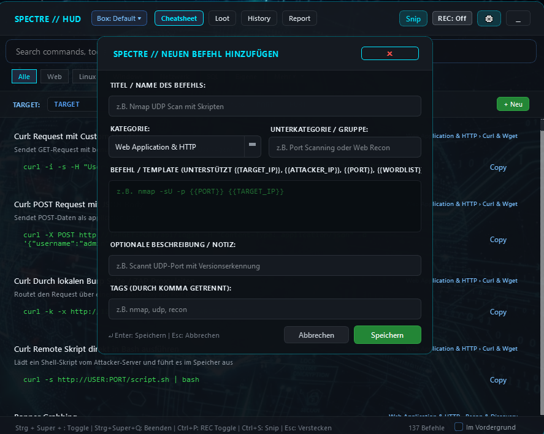

# 👻 SpectreHUD

> **Spotlight-artiges Cheatsheet- & Session-Loot-Overlay für CTF-Challenges und Pentest-Labs.**

SpectreHUD ist ein ultraschnelles, rahmenloses HUD-Overlay auf Basis von PyQt6 — per globalem Hotkey über jedem Fenster (Terminal, Browser, VM-Konsole) aufrufbar. Es bündelt Cheatsheet-Suche mit Variablen-Substitution, automatisches Clipboard-Logging (opt-in), Screenshot-Snipping, eine nach Pentest-Phasen kategorisierte Loot-Verwaltung und einen direkt im Fenster editierbaren Markdown-Report mit Live-Vorschau — sodass am Ende der Session ein fast fertiger Write-up steht, kein externer Editor nötig.


---

## 🚀 Features

- **⚡ Sofort-Suche per Hotkey** — `Strg + Super + <` holt das HUD über jedem beliebigen Fenster nach vorne, egal ob Terminal, Browser oder VM-Fenster gerade aktiv ist.
- **🎯 Dynamische Variablen** — `{{TARGET_IP}}`, `{{ATTACKER_IP}}`, `{{PORT}}`, `{{WORDLIST}}` werden live in alle Cheatsheet-Befehle eingesetzt, kein manuelles Copy-Paste-Anpassen mehr.
- **📁 Isolierte Projekt-Workspaces** — pro Box/Challenge ein eigener Workspace, eigene Loot-Historie, eigener Report.
- **📝 Session-Loot mit Pentest-Kategorisierung** — Credentials, Hashes, Directories, Flags und Notizen werden nicht nur nach Typ, sondern auch nach Phase einsortiert: Recon, Initial Access, Privilege Escalation, Post-Exploitation, Scripts, Sonstiges. In der Loot-Ansicht gruppiert nach Phase, direkt im Karten-Dialog nachträglich änderbar.
- **📷 Screenshot-Snipping** — Bereichsauswahl direkt ins Projekt-Loot-Verzeichnis, landet automatisch im Report.
- **🔴 Privacy-conscious, Opt-in Clipboard-Watcher** — startet standardmäßig **pausiert** (`⏸️ REC: Aus`), damit nichts versehentlich mitgeloggt wird. Ein Tastendruck (`Ctrl + P`) schaltet ihn explizit für die aktive Hacking-Session scharf.
- **📊 Editierbarer Report-Tab mit Live-Vorschau** — der generierte Markdown-Report lässt sich direkt im Fenster weiterschreiben (Splitter-Ansicht: Quelltext links, gerenderte Vorschau rechts), inklusive Backup vor jedem "Neu generieren" und Warnung bei ungespeicherten Änderungen.



---

## 📊 Phasenbasierter Report-Workflow

Der Report-Generator (`core/report_builder.py`) sortiert den gesamten gesammelten Loot automatisch in sechs feste Sektionen ein:

1. **🔍 Reconnaissance & Enumeration** — offene Ports, Service-Banner, gefundene URLs/Endpunkte
2. **🚪 Initial Access & Exploitation** — Credentials, Login-Nachweise, erster Fuß in der Tür
3. **👑 Privilege Escalation** — SUID-Binaries, geknackte Hashes, root/system-Flags
4. **🌐 Post-Exploitation & Lateral Movement** — interne Subnetze, Pivoting-Notizen, weitere Host-Creds
5. **📜 Custom Scripts & PoCs** — Exploits, eigene Automatisierung, Payloads
6. **📝 Sonstiges & Unkategorisiert** — alles, was sonst nirgends reinpasst

Jede Sektion endet mit einem Freitext-Platzhalter zum handschriftlichen Ausformulieren, danach folgen der chronologische Terminal-Verlauf und eine Executive-Summary-Vorlage. Wer den Report direkt weiterbearbeiten will, macht das im **Report-Tab** (`Strg+4`) statt in einem externen Editor — Speichern mit `Strg+Umschalt+S`, "Neu aus Loot generieren" sichert den bisherigen Stand automatisch als `report.md.bak`, bevor er überschrieben wird.

---

## ⌨️ Tastenkürzel

| Kürzel | Aktion |
|---|---|
| `Strg + Super + <` | HUD global ein-/ausblenden (funktioniert über jedem Fenster) |
| `Strg + Super + X` | Screenshot-Snipping starten (global) |
| `Strg + Super + Q` | SpectreHUD komplett beenden (global) |
| `Esc` | HUD verstecken |
| `Tab` | Zwischen Cheatsheet / Loot / History durchschalten |
| `Strg + 1` / `2` / `3` / `4` | Direkt zu Cheatsheet / Loot / History / Report springen |
| `Strg + F` | Suchleiste fokussieren |
| `Strg + N` | Neuen Loot-Eintrag anlegen |
| `Strg + S` | Screenshot aufnehmen |
| `Strg + P` | Clipboard-Logger pausieren/fortsetzen |
| `Strg + Umschalt + S` | Report-Tab: Änderungen speichern |

---

## 🔒 Sicherheit & Datenschutz

> [!WARNING]
> SpectreHUD ist als lokales Hilfsmittel für CTF-Challenges und autorisierte Pentest-Labs gedacht — nicht für den Einsatz gegen Produktivsysteme ohne Freigabe. Session-Loot und Clipboard-Verlauf werden **unverschlüsselt** als JSON im lokalen Projektordner abgelegt, damit sie sich leicht exportieren und einsehen lassen. Leg dort keine echten Produktiv-Zugangsdaten ab, und lass den Clipboard-Logger außerhalb aktiver Sessions pausiert (`Strg + P`).

---

## 🧭 Bekannte Einschränkungen

SpectreHUD ist primär für meinen eigenen Workflow gebaut (Single-Monitor, Windows/Linux). Folgendes ist bekannt, aber aktuell nicht behoben:

- **Screenshot erfasst nur den primären Monitor.** Bei Multi-Monitor-Setups wird alles auf sekundären Bildschirmen abgeschnitten.
- **macOS ist ungetestet.** Der globale Hotkey-Listener braucht dort die Bedienungshilfen-Berechtigung; ohne sie registriert sich der Hotkey lautlos nicht (Fallback: die Tray-Icon-Menüeinträge funktionieren trotzdem).
- **`Strg + Super` kann mit Fenstermanager-Shortcuts kollidieren**, je nach Linux-Desktopumgebung.

Stört dich eine dieser Einschränkungen für deinen Workflow? Gerne ein Issue aufmachen — schau ich mir an.

---

## 🛠️ Installation & Ausführung

### Standard-Installation

```bash
# Repository klonen
git clone https://github.com/m1thraz/SpectreHUD.git
cd SpectreHUD

# Als Paket installieren
pip install .

# Starten über den CLI Entry Point
spectrehud
```

### Für Entwickler (Editable Mode mit Test-Dependencies)

```bash
# Repository klonen
git clone https://github.com/m1thraz/SpectreHUD.git
cd SpectreHUD

# Editierbare Installation inklusive pytest
pip install -e ".[dev]"

# Test Suite ausführen
python -m pytest

# Starten
spectrehud
```

---

## 📄 Lizenz

Open Source unter der [MIT License](LICENSE).
