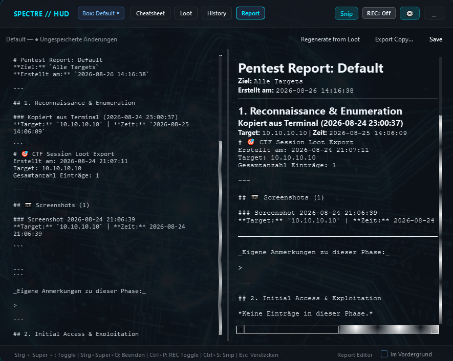

<p align="center">
  
</p>

# <p align="center">SpectreHUD</p>

<p align="center">
  
  
  
  
  
  
  
</p>

> **Tactical Spotlight-style cheatsheet, session loot manager, structured template engine, and live Markdown report HUD for CTFs and penetration testing labs.**

SpectreHUD is an ultra-fast, frameless HUD overlay built with PyQt6 — accessible anywhere via a global hotkey over terminals, browsers, and VM windows. It unifies instant cheatsheet search with dynamic variable replacement, an opt-in clipboard logger, native screenshot snipping, phase- and severity-categorized session loot management, a structured report template engine, and a live-preview editable Markdown report generator. At the end of your engagement or CTF box, you have a polished, professional write-up ready for export to Markdown or standalone HTML.


---

## ⚡ Key Capabilities

- **Instant Search via Global Hotkey** — `Ctrl + Super + <` (customizable) summons the HUD instantly over any active window (terminals, browsers, or VM consoles).
- **Dynamic Variables** — `{{TARGET_IP}}`, `{{ATTACKER_IP}}`, `{{PORT}}`, `{{WORDLIST}}` are replaced live across all cheatsheet commands. No more tedious manual copy-paste editing.
- **Multi-Location Workspaces & Project Registry** — Create isolated project workspaces anywhere on your filesystem (default directory or custom paths like `D:\CTF\BoxName`). SpectreHUD automatically indexes and remembers project locations for quick 1-click switching, imports, and ZIP archival.
- **Severity-Aware Session Loot** — Credentials, hashes, directories, flags, and notes are classified by pentest phase (*Recon, Initial Access, Privilege Escalation, Post-Exploitation, Custom Scripts, Misc*) and **Severity Level** (*Critical, High, Medium, Low, Info*), automatically calculating risk metrics summaries and severity badges.
- **Native Screenshot Snipping** — Region capture tool saves snippets directly into the active project's `loot/` directory and embeds them automatically into your reports and live previews.
- **Privacy-Conscious, Opt-in Clipboard Logger** — Starts **paused** by default (`REC: Off`) to protect your credentials. A single shortcut (`Ctrl + P`) or click activates logging exclusively for your active hacking session.
- **Report Editor V2 with Triple View Modes**:
  - **📝 Source Editor (`Ctrl + 1`)** — Monospace Markdown source editor for precise markup tweaks.
  - **◫ Split View (`Ctrl + 2`)** — Side-by-side synchronized Markdown editing and live rendering.
  - **👁️ Live Preview (`Ctrl + 3`)** — Fullscreen interactive HTML preview with WYSIWYG live editing and drag & drop image security sandboxing.
- **Structured Template Engine & Template Manager** — Choose from built-in industry templates (*Standard CTF Box, Web Application Pentest, Active Directory Assessment, Executive Summary*) or create custom user templates with JSON schema validation, dynamic placeholders, and structured sections.
- **1-Click HTML & ZIP Export**:
  - **Standalone HTML Exporter** — Generates self-contained, offline HTML reports with Cyber-Dark styling and embedded screenshots.
  - **Box Archiver** — Compresses the entire project workspace (`recon/`, `exploit/`, `loot/`, `report.md`, `project_state.json`) into a clean ZIP archive with path-traversal safeguards.
- **Full Internationalization (i18n)** — Dynamic language switching between **English (US)** and **German (Standard)** across all views, forms, dialogs, and reports.
- **Modular Settings & Hotkey Configuration** — Customize global toggle shortcuts, snip tool bindings, always-on-top behavior, and default variables in a cyber glassmorphism dialog (`Ctrl + ,`).


---

## 🛡️ Report Templates & Workflow

The template subsystem (`core/reporting/`) generates structured penetration testing write-ups populated automatically with your session loot and chronological command logs:

1. **Executive Summary & Scope** — Target IP/hostname, engagement dates, scope, and auto-calculated finding metrics summary.
2. **Reconnaissance & Enumeration** — Open ports, service banners, discovered URLs, and endpoints.
3. **Initial Access & Exploitation** — Discovered credentials, login proof, and foothold vectors.
4. **Privilege Escalation** — SUID binaries, cracked hashes, root/system flags.
5. **Post-Exploitation & Lateral Movement** — Internal subnets, pivoting notes, additional host accounts.
6. **Remediation & Hardening** — Actionable defensive countermeasures prioritized by severity.

Edit your report in the **Report Tab** (`Ctrl + 4`), customize templates in the **Template Manager** (`🎨 Templates...`), and save with `Ctrl + S`.



---

## ⌨️ Keyboard Shortcuts

| Shortcut | Scope | Action |
|---|---|---|
| `Ctrl + Super + <` | Global | Toggle SpectreHUD overlay visibility |
| `Ctrl + Super + X` | Global | Start region screenshot snip tool |
| `Ctrl + Super + Q` | Global | Quit SpectreHUD completely |
| `Esc` | In-App | Hide HUD overlay / Close modal dialog |
| `Ctrl + 1` / `2` / `3` / `4` | In-App | Switch Mode: Cheatsheet / Loot / History / Report Editor |
| `Ctrl + 1` / `2` / `3` | Report View | Switch View Mode: 📝 Editor / ◫ Split / 👁️ Live Preview |
| `Ctrl + F` | In-App | Focus spotlight command search |
| `Ctrl + N` | In-App | Add new command snippet or loot entry |
| `Ctrl + S` | In-App | Capture screenshot (or Save Report in Report tab) |
| `Ctrl + P` | In-App | Toggle clipboard recorder (REC: ON / REC: Paused) |
| `Ctrl + ,` | In-App | Open Settings & Hotkey Options |

---

## 🔒 Security & Resilience Guarantees

SpectreHUD is hardened against adversarial input, directory traversal, and data corruption:

1. **Path Traversal & Sandboxing**: All template IDs, project names, and image attachments are validated against strict regex patterns (`^[a-zA-Z0-9_-]{1,64}$`) and sandboxed within workspace boundaries using `Path.is_relative_to()`.
2. **ZIP Archiver Path Sanitization**: Archive creation normalizes internal file paths and prevents Zip-Slip vulnerabilities.
3. **Atomic Persistence & Rollback**: Writes to project states, user snippets, and Markdown reports utilize atomic file replacement (`.tmp_*` -> target rename) to protect against crashes or disk interruptions.
4. **Drag & Drop Security**: Image insertion into the report preview is strictly sandboxed to project `loot/` subdirectories with size limits (15 MB), preventing local file disclosure.
5. **Comprehensive Test Suite**: 40 test suites containing 244 unit, integration, and adversarial regression tests verified on every release.

> [!WARNING]
> SpectreHUD is intended as a local productivity tool for CTF challenges, training laboratories, and authorized penetration testing engagements. Session loot and clipboard logs are stored in **plaintext JSON** inside your local project folders for transparent inspection and easy export. Keep the clipboard recorder paused outside active sessions (`Ctrl + P`).

---

## 🖥️ Multi-Monitor & Platform Notes

- **Multi-Monitor Display Coverage:** SpectreHUD seamlessly captures and spans across all active displays in your virtual desktop (including negative x/y monitor offsets and mixed DPI configurations).
- **Linux Wayland Compatibility (`XDG_SESSION_TYPE=wayland`):** On modern Linux Wayland compositors (GNOME/KDE Wayland), direct screen capture without user portal prompts is restricted by the operating system's security architecture. If Qt's screen grab returns an empty canvas, SpectreHUD safely falls back and logs a diagnostic warning.

---

## 🚀 Installation & Execution

### Standalone Executable (Windows)

Download `SpectreHUD.exe` directly from the [GitHub Releases](https://github.com/m1thraz/SpectreHUD/releases) page and run it — no Python installation required!

To compile your own standalone single-file `.exe`:
```bash
python scripts/build_exe.py
# Output: dist/SpectreHUD.exe
```

### Standard Python Package Installation

```bash
# Clone the repository
git clone https://github.com/m1thraz/SpectreHUD.git
cd SpectreHUD

# Install package
pip install .

# Optional: Create Windows Desktop Shortcut with App Logo
python create_desktop_shortcut.py

# Launch via CLI entry point
spectrehud
```

### Developer Mode (Editable Install & Test Suite)

```bash
# Clone repository
git clone https://github.com/m1thraz/SpectreHUD.git
cd SpectreHUD

# Install in editable mode with development dependencies
pip install -e ".[dev]"

# Run full test suite (40 suites / 244 tests)
python run_tests.py
# Or via pytest
pytest

# Build distribution wheel & verify
pip wheel . --no-deps -w dist/
python scripts/verify_wheel.py dist/
```

---

## 📜 License

SpectreHUD is open source and licensed under the [MIT License](LICENSE).
