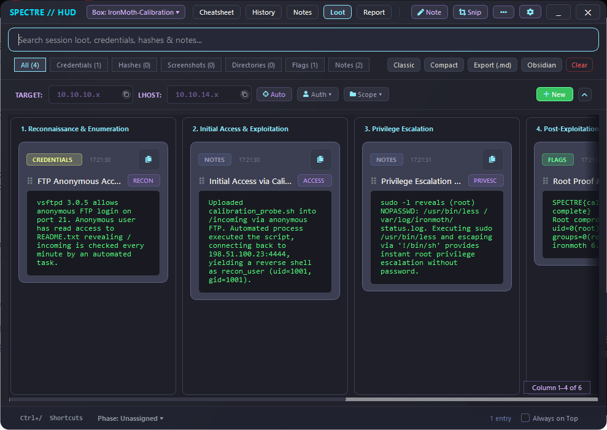
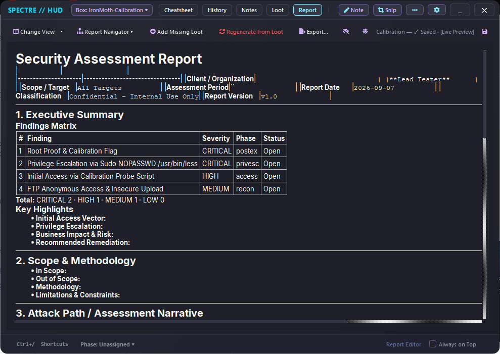
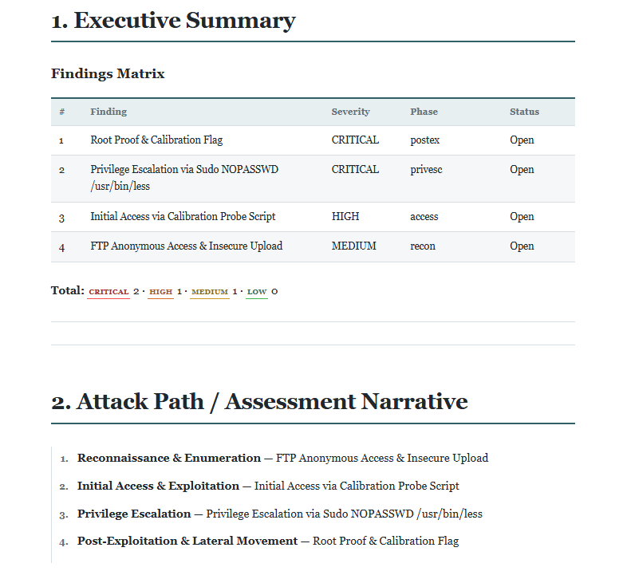

# SpectreHUD

[](https://github.com/m1thraz/SpectreHUD/actions/workflows/ci.yml)


<p align="center">
  
</p>

**A local companion that stays open through an entire CTF or pentest engagement, from the first recon command to the finished report**.

SpectreHUD is built to make **live pentest documentation as frictionless as possible**. Instead of reconstructing a report afterward from terminals, notes, screenshots, and browser tabs, the documentation grows alongside the engagement.


## Workflow

```text
                 Live engagement

Terminal / Browser / VM
          ↓
Clipboard History
          ↓
Quick Notes
          ↓
Loot / Findings
          ↓
Report
          │
          ├── Classic Web / Professional HTML / PDF
          │
          └── Obsidian / CherryTree
                        ↓
                 refine however you want
```

**Capture live in SpectreHUD, refine afterward wherever you prefer.**

Spectre is designed to reduce friction during testing, not to lock the finished report into one editor. Keep working in Spectre, finalize in editable HTML, or move the collected material into Obsidian or CherryTree for further editing and long-term documentation.

## What it does

- **Interactive cheatsheet** with reusable commands and live project variables
- **Quick-Find Spotlight HUD** (`Ctrl+Alt+F`) for instant snippet search and clipboard copying without leaving your terminal
- **Quick-IP popup** (`Ctrl+Alt+I`) to copy or change the active target without returning to the main window
- **Clipboard History** for capturing useful terminal and browser output
- **Quick Notes** with phase tagging and 1-click promotion into Loot
- **Quick Loot** for structured findings, targets, severity, recommendations, and captured evidence
- **Project-scoped screenshots** tied directly to the active engagement
- **Markdown report editor** with source, split, and editable live-preview modes
- **Add Missing Loot** to append newly captured findings without overwriting manual report edits
- **Classic Web export** for full manual control over the final HTML
- **Professional export** that restructures the report into a cleaner print-oriented format while remaining editable before PDF creation
- **Obsidian and CherryTree handoff** for continuing the report or preserving engagement knowledge in your preferred note-taking workflow
- **Markdown and portable exports**
- **Global hotkeys** (`Ctrl+Alt+H/X/N/I/F/Q`)
- **Tray integration**
- **English/German UI**
- **Built-in themes**, including Dracula, Catppuccin Mocha, Gruvbox, and Tokyo Night
- **Optional encrypted Pentest Mode** project state

### Cheatsheet & Community Snippets

To prevent antivirus false positives on packaged binaries (`.exe`, `.deb`), SpectreHUD partitions its command collection into two tiers:

- **Bundled Snippets (Default):** Pre-installed out of the box. Curated, antivirus-safe commands for recon, enumeration, and common assessment tasks.
- **Community Snippets (Optional):** Available as a separate download on the [GitHub Releases page](https://github.com/m1thraz/SpectreHUD/releases) (`community_snippets.json`). Contains advanced, payload-heavy, and explicit pentesting commands. You can load them directly into your database with one click via the **Import** button in the Cheatsheet view.


## From capture to report

Spectre keeps the documentation workflow connected from structured findings to the final deliverable.

| 1. Capture & structure | 2. Build & refine | 3. Finalize |
| :---: | :---: | :---: |
| [](assets/loot.png) | [](assets/report_editor.png) | [](assets/professional_report.png) |
| Notes and captured evidence become structured Loot. | Generate the report and keep editing it as the engagement evolves. | Let Spectre clean up the structure, make final edits, then print to PDF. |

## Engineering focus

SpectreHUD is intentionally a **single-user desktop application**.

Reliability work focuses on realistic desktop failure modes:

- atomic writes
- backup and recovery
- rollback during failed project changes
- corrupted-state recovery
- single-instance operation

It is not designed as a network service or as a hostile local-file processing environment. Customer-facing HTML exports are treated separately because captured target content may later be opened in a recipient's browser.

More details:

- [Architecture guide](docs/architecture.md)
- [Desktop threat model and test scope](docs/threat_model.md)
- [v2.2.1 release notes](docs/release_notes_v2.2.1.md)
- [Pentest Mode](docs/pentest_mode.md)
- [Contributor development guide](docs/development.md)
- [Changelog](CHANGELOG.md)

## Installation

### Windows executable

Download the current Windows build from the [GitHub Releases page](https://github.com/m1thraz/SpectreHUD/releases).

No Python installation is required.

### Linux

Requirements: Python 3.10+ and standard Qt6/XCB desktop runtime dependencies.

#### Ubuntu / Debian / Kali Linux

```bash
sudo apt-get update
sudo apt-get install -y libegl1 libgl1 libxcb-cursor0 libxkbcommon-x11-0 libdbus-1-3
```

#### Fedora / RHEL

```bash
sudo dnf install -y mesa-libEGL mesa-libGL libxkbcommon-x11 dbus-libs
```

#### Arch Linux

```bash
sudo pacman -S libxkbcommon-x11 xcb-util-cursor dbus
```

#### Install and run

```bash
git clone https://github.com/m1thraz/SpectreHUD.git
cd SpectreHUD
pip install .
spectrehud
```

Once published to PyPI, direct `pip install spectrehud` will also be available.

### From source / development

Requirements: Python 3.10+ on Windows or Linux.

```bash
git clone https://github.com/m1thraz/SpectreHUD.git
cd SpectreHUD
pip install -e ".[dev]"
python scripts/run_tests.py fast
```

The cross-platform test runner also provides `full`, `release`, `all`, and `targeted` modes. Calling it without a mode runs the complete unfiltered suite.

Build distributable artifacts with:

```bash
pip wheel . --no-deps --no-build-isolation -w dist/
python scripts/verify_wheel.py dist/
python scripts/build_exe.py
```

## Platform notes

Windows is the primary production-verified platform.
Linux X11 support is also veryfied.

Wayland acceptance is still being expanded across physical and virtualized desktop environments.
On modern Wayland compositors, global background key logging and arbitrary display grabbing are restricted by the compositor security model. SpectreHUD gracefully degrades to in-app keyboard shortcuts and provides clear UI guidance without blocking the application.

## Contributing and security

Focused contributions are welcome. Read [CONTRIBUTING.md](CONTRIBUTING.md) before opening a pull request.

Report suspected vulnerabilities privately according to [SECURITY.md](SECURITY.md), and never place credentials or engagement data in a public issue.

## License

Released under the [MIT License](LICENSE).
