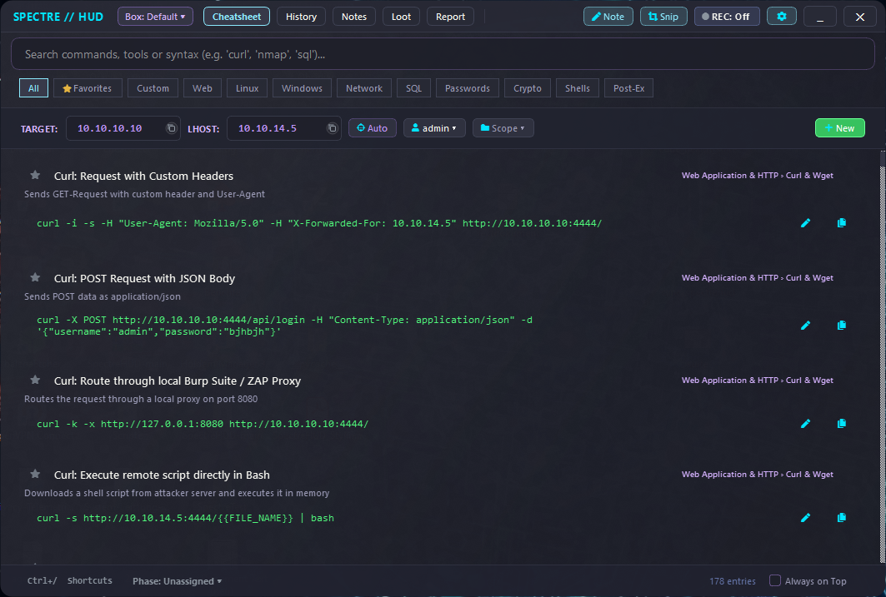

<p align="center">
  
</p>

# SpectreHUD

[](https://github.com/m1thraz/SpectreHUD/actions/workflows/ci.yml)


**A local companion that stays open through an entire CTF or pentest engagement, from the first recon command to the finished report.**

During a CTF or authorized engagement, the working context is usually scattered across a terminal, a notes app, a screenshot tool, and a handful of cheatsheet tabs, and the report gets reconstructed from memory afterward. SpectreHUD keeps that context in one place instead: target variables, reusable commands, clipboard findings, screenshots, and loot all live in the active project, and the Markdown report builds up alongside the work rather than after it.



## What it does

- Per-project target variables and reusable command snippets
- Loot, optional clipboard history, and region screenshots tied to the active project
- Markdown report editor with source, split, and live-preview views
- Structured report templates, editable standalone HTML, Markdown, Obsidian, and CherryTree exports
- Global hotkeys, tray integration, English/German UI, and optional encrypted Pentest-Mode project state

```text
Terminal / Browser / VM
          ↓
      SpectreHUD
          ↓
 Commands · Loot · Screenshots · Report
          ↓
 Obsidian / CherryTree / Portable export
```

## Engineering focus

SpectreHUD is intentionally a **single-user desktop application**. Its quality
work focuses on data integrity and normal desktop failure modes: atomic writes,
rollback during failed project changes, recovery from corrupted local state,
and a single application instance. It is not a network service or a hostile
local-file processor. Customer-facing exports are treated separately because
captured target content may be opened later in a recipient's browser.

For the implementation details, see:

- [Architecture guide](docs/architecture.md)
- [Desktop threat model and test scope](docs/threat_model.md)
- [v2.0.5 release notes](docs/release_notes_v2.0.5.md)
- [Pentest Mode](docs/pentest_mode.md)
- [Contributor development guide](docs/development.md)
- [Changelog](CHANGELOG.md)

## Contributing and security

Focused contributions are welcome. Read [CONTRIBUTING.md](CONTRIBUTING.md) before
opening a pull request. Report suspected vulnerabilities privately according to
[SECURITY.md](SECURITY.md), and never place credentials or engagement data in a
public issue.

## Platform Support & Verification Status

| Feature / Area | Windows | Linux (X11) | Linux (Wayland) |
|---|:---:|:---:|:---:|
| **Platform Verification Tier** | 🛡️ **Tier 1 (Production)** | 🧪 **Implemented & CI-Validated** | 🧪 **Implemented & CI-Validated** |
| **HUD Overlay & Cheatsheets** | ✅ Yes | ✅ Yes | ✅ Yes |
| **Loot Manager & Findings** | ✅ Yes | ✅ Yes | ✅ Yes |
| **Report Editor & Live Sync / Loot Append** | ✅ Yes | ✅ Yes | ✅ Yes |
| **Global System Hotkeys** | ✅ Yes | ✅ Yes | ⚠️ In-App Qt Shortcuts (`Esc`, `Ctrl+1..4`, etc.) |
| **Integrated Snip Screenshot Tool** | ✅ Yes | ✅ Yes | ⚠️ Restricted by compositor (Informative Tooltip) |
| **VPN / Local IP Discovery (`ip -j`)** | ✅ Yes | ✅ Yes (`ip -j`) | ✅ Yes (`ip -j`) |
| **XDG Base Directory Spec Compliance** | N/A | ✅ Yes (`~/.config`, `~/.local/share`) | ✅ Yes (`~/.config`, `~/.local/share`) |
| **Desktop Integration (`.desktop`, Hicolor Icons)** | N/A | ✅ Yes | ✅ Yes |

## Installation

### Windows executable

Download the current Windows build from the [GitHub Releases page](https://github.com/m1thraz/SpectreHUD/releases). No Python installation is required.

### Linux

Requirements: Python 3.10+ and standard Qt6/XCB desktop runtime dependencies.

**System dependencies:**

* **Ubuntu / Debian / Kali Linux:**
  ```bash
  sudo apt-get update
  sudo apt-get install -y libegl1 libgl1 libxcb-cursor0 libxkbcommon-x11-0 libdbus-1-3
  ```
* **Fedora / RHEL:**
  ```bash
  sudo dnf install -y mesa-libEGL mesa-libGL libxkbcommon-x11 dbus-libs
  ```
* **Arch Linux:**
  ```bash
  sudo pacman -S libxkbcommon-x11 xcb-util-cursor dbus
  ```

**Install & Run:**

```bash
git clone https://github.com/m1thraz/SpectreHUD.git
cd SpectreHUD
pip install .
spectrehud
```

*(Once published to PyPI, direct `pip install spectrehud` will also be available).*

### From source & development

Requirements: Python 3.10+ on Windows or Linux.

```bash
git clone https://github.com/m1thraz/SpectreHUD.git
cd SpectreHUD
pip install -e ".[dev]"
python scripts/run_tests.py
```

Build the distributable artifacts with:

```bash
pip wheel . --no-deps --no-build-isolation -w dist/
python scripts/verify_wheel.py dist/
python scripts/build_exe.py
```

## Platform notes

Windows is the primary production-verified platform. Linux support is implemented and CI-validated; real-desktop X11/Wayland acceptance is still being expanded across physical and virtualized desktop environments.

On modern Wayland compositors, global background key logging and arbitrary display grabbing are restricted by the compositor security model; SpectreHUD gracefully degrades to in-app keyboard shortcuts and provides clear UI tooltips without blocking the application.

## License

Released under the [MIT License](LICENSE).
