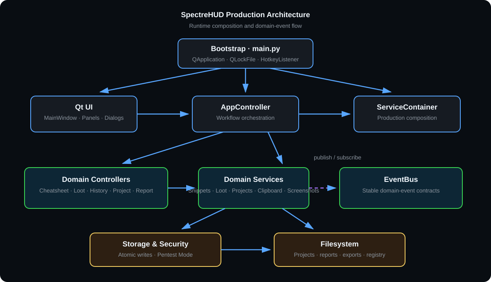

# SpectreHUD Architecture & Technical Guide

**Last updated:** v2.0.0

This document provides a technical overview of SpectreHUD's software
architecture, component relationships, design patterns, and intentional
product boundaries.

---

## 1. High-Level Architecture Overview

SpectreHUD follows a **layered, decoupled architecture** built upon Qt 6 (PyQt6), Python 3.10+, dependency injection, reactive event dispatching, and storage abstractions.



The diagram reflects the production dependency flow. Solid arrows represent runtime
composition or calls; the dashed EventBus link represents domain-event delivery.

```mermaid
graph TD
    Bootstrap[main.py: QApplication + QLockFile] --> UI[UI Shell / Panels: MainWindow, Panels, Dialogs]
    UI --> AppCtrl[AppController]
    AppCtrl --> DomainCtrls[Domain Controllers: Cheatsheet, Loot, History, Project, Report]
    DomainCtrls --> EventBus[EventBus (core/event_bus.py)]
    DomainCtrls --> Services[Domain Services: LootManager, SnippetManager, ProjectManager, etc.]
    AppCtrl --> Container[ServiceContainer (core/container.py)]
    Container --> Services
    Services --> Storage[StorageBackend: FileStorageBackend / InMemoryStorageBackend]
    Services --> Security[ProjectLockService + crypto_service]
    Storage --> Filesystem[(Atomic Filesystem / OS)]
```

---

## 2. Architectural Layers & Components

### 2.1 UI Presentation Layer (`ui/`)
- **`MainWindow` (`ui/main_window.py`)**: Frameless, transparent, Spotlight-style overlay shell. Handles native window movement, geometry positioning, global keyboard shortcuts and tray integration. A double-click on a non-interactive empty area (or `Ctrl + Space`) toggles fullscreen.
- **Panels (`ui/panels/`)**:
  - `HeaderPanel`: Title, project switcher dropdown, language toggle, and action buttons.
  - `SearchPanel`: Real-time fuzzy query input with filter tags.
  - `VariableBar`: Dynamic template parameter substitutions (`{target_ip}`, `{lhost}`, `{lport}`, `{wordlist}`, etc.).
  - `ContentPanel`: Multi-mode view container (Cheatsheet, Loot, History, Report Editor).
  - `FooterPanel`: Status bar, shortcut hints, and active recording indicators.
- **Dialogs (`ui/`)**: Modal forms for snippets, loot, custom variables, settings, template management and Pentest-Mode unlock. Dialog text is resolved through the active locale where available.

### 2.2 Domain & Workflow Controllers (`ui/controllers/`)
- **`AppController` (`ui/app_controller.py`)**: The central coordinator connecting UI signals, mode switching, and domain controllers.
- **Sub-Controllers**:
  - `CheatsheetController`: Filtering, variable substitution, and snippet copying.
  - `LootController`: Loot CRUD operations, tabular search, and export generation.
  - `HistoryController`: Clipboard command log ingestion, filtering, and loot promotions.
  - `ProjectController`: Project creation, switching, validation, and metadata persistence.
  - `ReportController`: Lazily constructs the report tab on first use, then coordinates report loading, Markdown editing and export.
- **UI Decoupling with DTOs (`core/menu_actions.py` & `ui/menu_builder.py`)**:
  - Controllers build context menus using pure Python `MenuAction` data transfer objects (`label`, `callback`, `icon`, `is_separator`, `is_enabled`).
  - `MenuBuilder.build_qmenu()` converts these DTOs into Qt `QMenu` instances at the view boundary. Menu construction can therefore be tested without showing a window; controllers that own dialogs or cards still require Qt-aware tests.

### 2.3 Reactive Event Bus (`core/event_bus.py`)
- Provides loose coupling between services and controllers via publish/subscribe.
- **`EventType` Events**: `PROJECT_CHANGED`, `PROJECT_CREATED`, `PROJECT_ACTIVATED`, `LOOT_UPDATED`, `HISTORY_UPDATED`, `SNIPPETS_UPDATED`, `LOGGING_STATE_CHANGED`, `MODE_CHANGED`, `SCREENSHOT_SAVED`, `LANGUAGE_CHANGED`, `SEARCH_CHANGED`, `VARIABLES_CHANGED`, and `HOTKEY_SETTINGS_CHANGED`.
- **Thread-Safe & Fault-Tolerant**: Protected by `threading.RLock`, with exception isolation so a failing subscriber cannot crash the publisher or other listeners.
- **State-Mutation Contract**: Each successful loot or clipboard-history mutation emits
  exactly one domain event, published by its owning service rather than a controller.
  `LOOT_UPDATED` payloads always contain `action`, `entry`, and `entries`;
  `HISTORY_UPDATED` payloads always contain `action`, `entry`, and `history`.
  `entry` is `null` for whole-collection actions such as `clear` and `replace`.

### 2.4 Dependency Injection & Service Container (`core/container.py`)
- **`ServiceContainer`**: Coordinates all core managers, storage backends, and event buses in one place.
- **Factory Methods**:
  - `ServiceContainer.create_production(...)`: Instantiates filesystem-backed storage, default config directories, and locale settings.
  - `ServiceContainer.create_isolated_test_container(...)`: Uses in-memory storage for configuration and session data, plus isolated temporary filesystem directories for filesystem-dependent services such as `ProjectManager` and `ReportFileManager`. It is designed for test isolation and does not guarantee zero disk I/O.
  - `ServiceContainer.create_in_memory(...)`: Compatibility alias for `create_isolated_test_container(...)`. It shares the same isolated temporary-directory behaviour.

### 2.5 Storage Abstraction Layer (`core/storage.py`)
- **`StorageBackend` Interface**:
  - `load_json(file_or_key, default)`
  - `save_json(file_or_key, data)`
  - `delete(file_or_key)`
  - `exists(file_or_key)`
- **`FileStorageBackend`**: Uses atomic writes (`core/atomic_write.py`) with temporary file swapping (`.tmp_*` -> rename) and maximum file size guards (`core/validators.py`).
- **`InMemoryStorageBackend`**: Pure memory store with deep-copy isolation.
- **Crash-Safe Persistence**: Project-state files and the in-memory project registry
  use atomic replacement, so interrupted writes never expose partial JSON. SpectreHUD
  permits one application instance only; registry mutations therefore update the active
  in-memory state and commit it atomically rather than coordinating concurrent writers.
- **Application Instance Boundary**: SpectreHUD acquires a process-wide Qt
  `QLockFile` before its service container, workspace, or UI are initialized, so only
  one interactive SpectreHUD instance can run at a time. Registry recovery remains
  intentional for corrupted or interrupted writes, but the registry no longer carries
  cross-process locking or merge semantics because concurrent SpectreHUD writers are
  not a supported system state.

### 2.6 Virtual Qt Item Models (`ui/models/`)
- Replaces manual widget row creation with virtualized Qt item models:
  - `LootTableModel` (`QAbstractTableModel`): 6 columns, custom alignments, and `UserRole` payload access.
  - `SnippetListModel` (`QAbstractListModel`): Virtualized snippet list with HTML tooltips.
  - `HistoryTableModel` (`QAbstractTableModel`): 4 columns for command and clipboard history logs.

### 2.7 Modular Style System (`ui/styles/`)
- Deconstructed QSS stylesheets into cohesive modules:
  - `palette.py`: Color constants and semantic palette definitions.
  - `typography.py`: Font families, font weights, and size hierarchies.
  - `buttons.py`: Standard, primary, and ghost button styling.
  - `tables.py`: Table views, header styling, and row selection states.
  - `cards.py`: Snippet card containers and code blocks.
  - `dialogs.py`: Modal dialogues, form layouts, and inputs.
  - `theme.py`: Aggregator generating the complete `CYBER_DARK_QSS` theme.

### 2.8 Structured Template Engine & Repository Subsystem (`core/reporting/`)
- **`ReportTemplate` & `TemplateSection` (`template_engine.py`)**: Strict data models defining pentest report structures with section requirements, auto-append directives, and dynamic parameters.
- **`TemplateRepository` (`template_repository.py`)**: Dual-tier template storage loading built-in factory templates and sandboxed custom user templates with ID regex validation (`^[a-zA-Z0-9_-]{1,64}$`).
- **`ReportTemplateEngine` (`template_engine.py`)**: Renders structured Markdown write-ups from templates, replacing placeholders (`{{TARGET_IP}}`, `{{DATE}}`, `{{METRICS_SUMMARY}}`), formatting tabular findings with pipe escaping, and organizing loot by phase and severity.
- **`FindingMetrics` & `render_severity_badge` (`charts.py`)**: Calculates finding distribution and renders visual HTML severity badges (*Critical, High, Medium, Low, Info*).
- **`ReportEditorTab` (`ui/report_editor_tab.py`)**: Composes the Markdown source editor, view state, autosave and export workflow. Report dialogs, preview/document handling, formatting-toolbar construction and find/replace live in focused modules under `ui/report/`.

### 2.9 Archival & Standalone Export Subsystems (`core/`)
- **`BoxArchiver` (`core/box_archiver.py`)**: Compresses complete project workspaces into portable `.zip` archives while retaining their project-relative layout.
- **`HtmlReportExporter` (`core/html_report_exporter.py`)**: Converts Markdown reports into self-contained HTML documents with embedded base64 screenshots, responsive layouts and selectable Dark or Light client/print styling. Generated HTML permits in-browser body editing and image resizing, and can save a cleaned edited copy without its editing controls.

### 2.10 Dynamic Internationalization Subsystem (`core/i18n.py`)
- **`I18nManager`**: Thread-safe internationalization runtime supporting live locale switching (`de` / `en`) without application restart.
- **Parametric Interpolation**: Supports variable substitution (e.g. `{count}`, `{target}`) and fallback defaults for the application surfaces that use the active locale. Remaining literal dialog text is tracked as UI-localization work rather than implied to be universally translated.

---

## 3. Reliability & Local Data Handling

SpectreHUD is a single-user local desktop application, not a multi-tenant or
network-facing service. Its primary quality goal is preserving the user's work
through ordinary desktop failures—interrupted writes, corrupted local state,
and failed project switches. The safeguards below document implementation
behaviour; they are not presented as a defence against a realistic remote or
same-user adversary. Customer-facing exports are the deliberate exception:
target-derived report content crosses into a recipient's browser or knowledge
base and is escaped accordingly. See the [desktop threat model](threat_model.md)
for the two trust boundaries and their test rationale.

1. **Name and workspace validation**:
   - `core/validators.py` keeps project names, output paths, and template IDs valid for the local workspace.
   - `core/project/repository.py` validates created and imported project locations before registering them.
2. **Defensive local-file limits**:
   - File-size thresholds on JSON state, templates, notes, and screenshots help avoid an accidental UI stall or unusable local state.
3. **Atomic file persistence**:
   - `core/atomic_write.py` ensures power-loss and crash resilience by writing to unique temp files before atomically replacing target JSON/markdown files.
4. **Single source of truth for session data**:
   - `project_state.json` inside each project folder is the sole source of truth for loot, variables, and clipboard history.
   - `LootManager` and `ClipboardWatcher` operate as session buffers in RAM, avoiding redundant and conflicting global storage files.
5. **Stable report formatting**:
   - The Markdown exporter adapts code fences and escapes table pipes so captured command output does not break a generated report.
6. **Safe customer-facing exports**:
   - HTML export escapes active content and unsafe URL schemes, while image and attachment resolution stays within the active project and selected export destination.
6. **Structured and rotating logging (`core/logger.py`)**:
   - Hierarchical namespacing (`spectrehud.<module>`), `SPECTRE_LOG_LEVEL` environment configuration, 5 MB file threshold, and 3-backup log rotation. File logging is configured lazily at bootstrap, keeping module imports 100% side-effect free.
7. **Optional Pentest-Mode state encryption**:
   - `ProjectStateStore` encrypts only a Pentest-Mode project's `project_state.json` with authenticated Fernet encryption. `crypto_service.py` derives a key using PBKDF2-SHA256; `ProjectLockService` retains that key only for the unlocked process session.
   - `security_meta.json` contains the salt, safe KDF parameters and an encrypted verifier, never a password or usable project key. `report.md`, notes, screenshots and user-selected plaintext exports are intentionally outside this scope. See [Pentest Mode](pentest_mode.md).

---

## 4. Multi-Location Workspace & Registry Semantics

- **Default Workspace (`workspace_dir`)**: Configures the base directory where newly created CTF box projects are stored by default.
- **Multi-Location Registry (`projects_registry.json`)**: Allows projects to reside across multiple locations (e.g. secondary drives, mounted network shares, imported folders) without moving them into the default workspace. Changing `workspace_dir` in Settings updates the default path for future boxes while preserving existing registered project locations.
- **Workspace Commit Boundary**: Candidate workspace discovery is read-only until the
  runtime session and `workspace_dir` config commit both succeed. Only afterwards is
  the registry synchronized, so a failed workspace switch cannot persist discovered
  entries from the candidate workspace.

---

## 5. Testing & CI/CD Strategy

- **Master Test Runner (`run_tests.py`)**:
  - Delegates to the pytest collection under `tests/` and runs headlessly (`QT_QPA_PLATFORM=offscreen`).
  - Test counts are intentionally not treated as release documentation: parametrization and regression additions change them. The current CI result is the release evidence.
- **GitHub Actions CI (`.github/workflows/ci.yml`)**:
  - Multi-OS matrix: `ubuntu-latest`, `windows-latest`.
  - Python matrix: `3.10`, `3.11`, `3.12`, `3.13`.
  - Linux headless display setup using `xvfb-run`.
  - Automated `flake8` syntax validation, pytest execution and Linux coverage reporting.

---

## 6. Known Limitations & Intentional Boundaries

- SpectreHUD supports one interactive application instance. Collaborative editing, cloud synchronisation, and concurrent project writers are not supported states.
- The product is designed for normal workstation inputs selected by its user. It does not claim to defend against malware running as that user, intentionally hostile local files, or a compromised operating system.
- Screenshot behaviour on Linux depends on the display server and compositor; Wayland can restrict direct capture.
- Pentest Mode encrypts `project_state.json` only. Screenshots, reports, notes, and user-selected exports remain deliberately plaintext so they can be used in the surrounding workflow.
- `core.html_report_exporter`, `get_event_bus()` and the remaining legacy method aliases are retained only as public compatibility surfaces. Internal project-management imports use the canonical `core.project` package; the unused `core.project_manager` facade has been removed.
